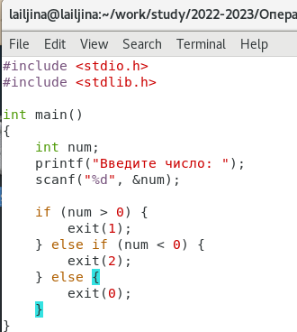

---
## Front matter
<<<<<<< HEAD
<<<<<<< HEAD
title: "Отчёт по лабораторной работе №12"
subtitle: "Операционные системы"
author: "Ильина Любовь Александровна"
=======
title: "Шаблон отчёта по лабораторной работе"
subtitle: "Простейший вариант"
author: "Дмитрий Сергеевич Кулябов"
>>>>>>> 0e3808ad83c71a3b724cc932a6caab5ce4fedc0a
=======
title: "Шаблон отчёта по лабораторной работе"
subtitle: "Простейший вариант"
author: "Дмитрий Сергеевич Кулябов"
>>>>>>> 0e3808ad83c71a3b724cc932a6caab5ce4fedc0a

## Generic otions
lang: ru-RU
toc-title: "Содержание"

## Bibliography
bibliography: bib/cite.bib
csl: pandoc/csl/gost-r-7-0-5-2008-numeric.csl

## Pdf output format
toc: true # Table of contents
toc-depth: 2
lof: true # List of figures
lot: true # List of tables
fontsize: 12pt
linestretch: 1.5
papersize: a4
documentclass: scrreprt
## I18n polyglossia
polyglossia-lang:
  name: russian
  options:
	- spelling=modern
	- babelshorthands=true
polyglossia-otherlangs:
  name: english
## I18n babel
babel-lang: russian
babel-otherlangs: english
## Fonts
mainfont: PT Serif
romanfont: PT Serif
sansfont: PT Sans
monofont: PT Mono
mainfontoptions: Ligatures=TeX
romanfontoptions: Ligatures=TeX
sansfontoptions: Ligatures=TeX,Scale=MatchLowercase
monofontoptions: Scale=MatchLowercase,Scale=0.9
## Biblatex
biblatex: true
biblio-style: "gost-numeric"
biblatexoptions:
  - parentracker=true
  - backend=biber
  - hyperref=auto
  - language=auto
  - autolang=other*
  - citestyle=gost-numeric
## Pandoc-crossref LaTeX customization
figureTitle: "Рис."
tableTitle: "Таблица"
listingTitle: "Листинг"
lofTitle: "Список иллюстраций"
lotTitle: "Список таблиц"
lolTitle: "Листинги"
## Misc options
indent: true
header-includes:
  - \usepackage{indentfirst}
  - \usepackage{float} # keep figures where there are in the text
  - \floatplacement{figure}{H} # keep figures where there are in the text
---

# Цель работы

<<<<<<< HEAD
<<<<<<< HEAD
Изучение основ программирования в оболочке ОС UNIX. Научиться писать более сложные командные файлы с использованием логических управляющих конструкций и циклов.

# Выполнение лабораторной работы

1. Используя команды getopts grep, напишем командный файл, который анализирует командную строку с ключами (рис. @fig:001 - @fig:002):
– -iinputfile — прочитать данные из указанного файла;
– -ooutputfile — вывести данные в указанный файл;
– -pшаблон — указать шаблон для поиска;
– -C — различать большие и малые буквы;
– -n — выдавать номера строк.
а затем ищет в указанном файле нужные строки, определяемые ключом -p.

{#fig:001}

{#fig:002}

2. Написать на языке Си программу, которая вводит число и определяет, является
ли оно больше нуля, меньше нуля или равно нулю. Затем программа завершается
с помощью функции exit(n), передавая информацию в о коде завершения в
оболочку. Командный файл должен вызывать эту программу и, проанализировав
с помощью команды $?, выдать сообщение о том, какое число было введено.
(рис. @fig:003 - @fig:005)

{#fig:003}

{#fig:004}

{#fig:005}

Проверяю работу файлов (рис. @fig:006)

{#fig:006}

3. Написать командный файл, создающий указанное число файлов, пронумерованных последовательно от 1 до N (например 1.tmp, 2.tmp, 3.tmp,4.tmp и т.д.).
Число файлов, которые необходимо создать, передаётся в аргументы командной
строки. Этот же командный файл должен уметь удалять все созданные им файлы
(если они существуют). (рис. @fig:007 - @fig:008)

{#fig:007}

Проверяю работу файлов (рис. @fig:008)

{#fig:008}

4. Написать командный файл, который с помощью команды tar запаковывает в
архив все файлы в указанной директории. Модифицировать его так, чтобы запаковывались только те файлы, которые были изменены менее недели тому назад
(использовать команду find). (рис. @fig:009 - @fig:010)

{#fig:009}

Проверяю работу файлов (рис. @fig:010)

{#fig:010}

Контрольные вопросы 

1. Каково предназначение команды getopts? 
getopts осуществляет синтаксический анализ командной строки, выделяя флаги, и используется для объявления переменных. Функция getopts также понимает переменные типа массив, следовательно, можно использовать её в функции не только для синтаксического анализа аргументов функций, но и для анализа введённых пользователем данных.
2. Какое отношение метасимволы имеют к генерации имён файлов?
Метасимволы позволяют генерировать имена файлов на основе заданного шаблона.
3. Какие операторы управления действиями вы знаете?
- test -f file - возвращает нулевой код завершения (истина), если файл file существует, и ненулевой код завершения (ложь) в противном случае:
– test s –— истина, если аргумент s имеет значение истина;
– test -f file — истина, если файл file существует;
– test -i file — истина, если файл file доступен по чтению;
– test -w file — истина, если файл file доступен по записи;
– test -e file — истина, если файл file — исполняемая программа;
– test -d file — истина, если файл file является каталогом.
4. Какие операторы используются для прерывания цикла?
Команда break завершает выполнение цикла, а команда continue завершает данную
итерацию блока операторов.
5. Для чего нужны команды false и true?
 команда true, которая всегда возвращает код завершения, равный нулю (т.е. истина), и команда false, которая всегда возвращает код завершения, не равный нулю (т. е. ложь).
6. Что означает строка if test -f man$s/$i.$s, встреченная в командном файле?
проверяет, существует ли файл с именем man<значение переменной $s>/<значение переменной $i>.<значение переменной $s> в текущем каталоге

7. Объясните различия между конструкциями while и until.
При замене в операторе цикла while служебного слова while на until условие,
при выполнении которого осуществляется выход из цикла, меняется на противоположное. В остальном оператор цикла while и оператор цикла until идентичны.

# Выводы

Изучила основы программирования в оболочке ОС UNIX. Научится писать более сложные командные файлы с использованием логических управляющих конструкций и циклов.

=======
=======
>>>>>>> 0e3808ad83c71a3b724cc932a6caab5ce4fedc0a
Здесь приводится формулировка цели лабораторной работы. Формулировки
цели для каждой лабораторной работы приведены в методических
указаниях.

Цель данного шаблона --- максимально упростить подготовку отчётов по
лабораторным работам.  Модифицируя данный шаблон, студенты смогут без
труда подготовить отчёт по лабораторным работам, а также познакомиться
с основными возможностями разметки Markdown.

# Задание

Здесь приводится описание задания в соответствии с рекомендациями
методического пособия и выданным вариантом.

# Теоретическое введение

Здесь описываются теоретические аспекты, связанные с выполнением работы.

Например, в табл. @tbl:std-dir приведено краткое описание стандартных каталогов Unix.

: Описание некоторых каталогов файловой системы GNU Linux {#tbl:std-dir}

| Имя каталога | Описание каталога                                                                                                          |
|--------------|----------------------------------------------------------------------------------------------------------------------------|
| `/`          | Корневая директория, содержащая всю файловую                                                                               |
| `/bin `      | Основные системные утилиты, необходимые как в однопользовательском режиме, так и при обычной работе всем пользователям     |
| `/etc`       | Общесистемные конфигурационные файлы и файлы конфигурации установленных программ                                           |
| `/home`      | Содержит домашние директории пользователей, которые, в свою очередь, содержат персональные настройки и данные пользователя |
| `/media`     | Точки монтирования для сменных носителей                                                                                   |
| `/root`      | Домашняя директория пользователя  `root`                                                                                   |
| `/tmp`       | Временные файлы                                                                                                            |
| `/usr`       | Вторичная иерархия для данных пользователя                                                                                 |

Более подробно об Unix см. в [@gnu-doc:bash;@newham:2005:bash;@zarrelli:2017:bash;@robbins:2013:bash;@tannenbaum:arch-pc:ru;@tannenbaum:modern-os:ru].

# Выполнение лабораторной работы

Описываются проведённые действия, в качестве иллюстрации даётся ссылка на иллюстрацию (рис. @fig:001).

{#fig:001 width=70%}

# Выводы

Здесь кратко описываются итоги проделанной работы.

# Список литературы{.unnumbered}

::: {#refs}
:::
<<<<<<< HEAD
>>>>>>> 0e3808ad83c71a3b724cc932a6caab5ce4fedc0a
=======
>>>>>>> 0e3808ad83c71a3b724cc932a6caab5ce4fedc0a
