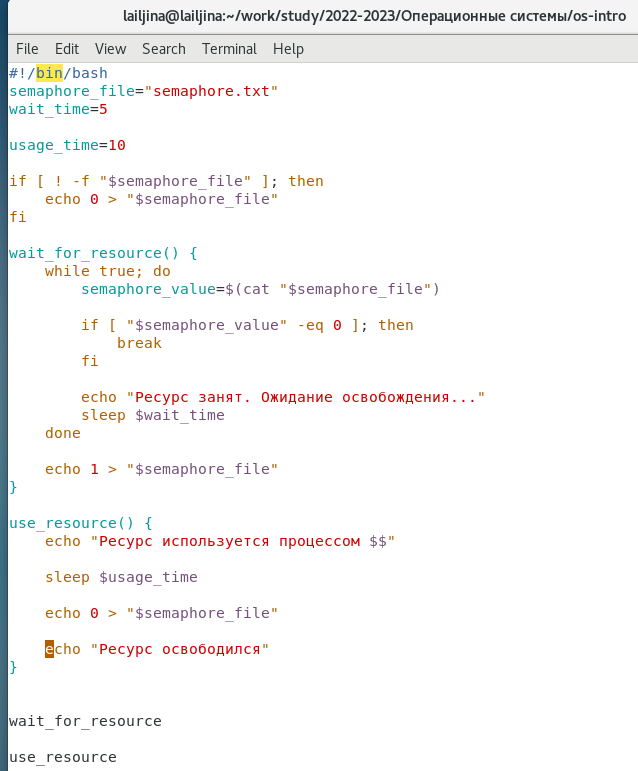
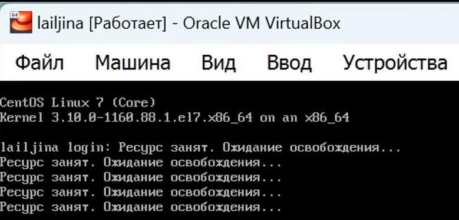
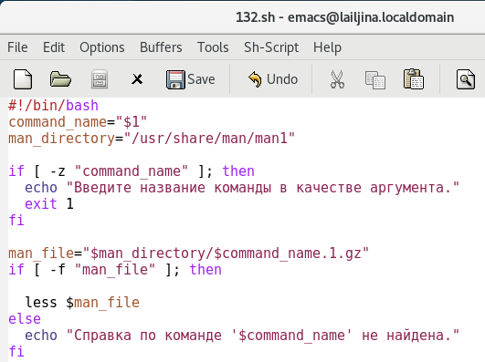
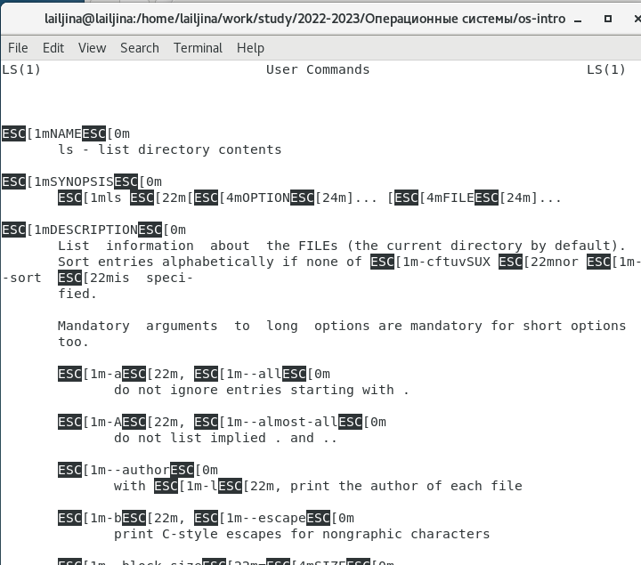
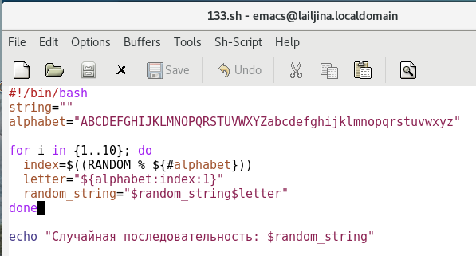

---
## Front matter
<<<<<<< HEAD
title: "Отчёт по лабораторной работе №13"
subtitle: "Операционные системы"
author: "Ильина Любовь Александровна"
=======
title: "Шаблон отчёта по лабораторной работе"
subtitle: "Простейший вариант"
author: "Дмитрий Сергеевич Кулябов"
>>>>>>> 0e3808ad83c71a3b724cc932a6caab5ce4fedc0a

## Generic otions
lang: ru-RU
toc-title: "Содержание"

## Bibliography
bibliography: bib/cite.bib
csl: pandoc/csl/gost-r-7-0-5-2008-numeric.csl

## Pdf output format
toc: true # Table of contents
toc-depth: 2
lof: true # List of figures
lot: true # List of tables
fontsize: 12pt
linestretch: 1.5
papersize: a4
documentclass: scrreprt
## I18n polyglossia
polyglossia-lang:
  name: russian
  options:
	- spelling=modern
	- babelshorthands=true
polyglossia-otherlangs:
  name: english
## I18n babel
babel-lang: russian
babel-otherlangs: english
## Fonts
mainfont: PT Serif
romanfont: PT Serif
sansfont: PT Sans
monofont: PT Mono
mainfontoptions: Ligatures=TeX
romanfontoptions: Ligatures=TeX
sansfontoptions: Ligatures=TeX,Scale=MatchLowercase
monofontoptions: Scale=MatchLowercase,Scale=0.9
## Biblatex
biblatex: true
biblio-style: "gost-numeric"
biblatexoptions:
  - parentracker=true
  - backend=biber
  - hyperref=auto
  - language=auto
  - autolang=other*
  - citestyle=gost-numeric
## Pandoc-crossref LaTeX customization
figureTitle: "Рис."
tableTitle: "Таблица"
listingTitle: "Листинг"
lofTitle: "Список иллюстраций"
lotTitle: "Список таблиц"
lolTitle: "Листинги"
## Misc options
indent: true
header-includes:
  - \usepackage{indentfirst}
  - \usepackage{float} # keep figures where there are in the text
  - \floatplacement{figure}{H} # keep figures where there are in the text
---

# Цель работы

<<<<<<< HEAD
Изучить основы программирования в оболочке ОС UNIX. Научиться писать более сложные командные файлы с использованием логических управляющих конструкций и циклов.

# Выполнение лабораторной работы

1. Написать командный файл, реализующий упрощённый механизм семафоров. Командный файл должен в течение некоторого времени t1 дожидаться освобождения ресурса, выдавая об этом сообщение, а дождавшись его освобождения, использовать его в течение некоторого времени t2<>t1, также выдавая информацию о том, что ресурс используется соответствующим командным файлом (процессом). Запустить командный файл в одном виртуальном терминале в фоновом режиме, перенаправив его вывод в другой (> /dev/tty#, где # — номер терминала куда перенаправляется вывод), в котором также запущен этот файл, но не фоновом, а в привилегированном режиме. Доработать программу так, чтобы имелась возможность взаимодействия трёх и более процессов. (рис. @fig:001 - @fig:003)

{#fig:001}

{#fig:002}

{#fig:003}

2. Реализовать команду man с помощью командного файла. Изучите содержимое каталога /usr/share/man/man1. В нем находятся архивы текстовых файлов, содержащих справку по большинству установленных в системе программ и команд. Каждый архив можно открыть командой less сразу же просмотрев содержимое справки. Командный файл должен получать в виде аргумента командной строки название команды и в виде результата выдавать справку об этой команде или сообщение об отсутствии справки, если соответствующего файла нет в каталоге man1. (рис. @fig:004 - @fig:005)

{#fig:004}

{#fig:005}

3. Используя встроенную переменную $RANDOM, напишите командный файл, генерирующий случайную последовательность букв латинского алфавита. Учтите, что $RANDOM выдаёт псевдослучайные числа в диапазоне от 0 до 32767 (рис. @fig:006 - @fig:007)

{#fig:006}

{#fig:007}

1. Исправление синтаксической ошибки в строке while [$1 != "exit"] :
while [[ $1 != "exit" ]]

2. Как объединить (конкатенация) несколько строк в одну?
с помощью + и = можно объединить несколько строк в одну:concatenated_string="$string1$string2"

3. Найдите информацию об утилите seq. Какими иными способами можно реализовать её функционал при программировании на bash?
Утилита seq в bash используется для генерации последовательностей чисел.
Реализовать функционал возможно циклами:
```
 for ((i=1; i<=10; i++))
current=$start
while [ $current -le $end ]
do
    echo "$current"
    current=$((current + 1))
done
```

4. Какой результат даст вычисление выражения $((10/3))?
целочисленное деление даст результат 3.

5. Укажите кратко основные отличия командной оболочки zsh от bash.
Конфигурационные файлы: Bash использует файлы ~/.bashrc и ~/.bash_profile для настройки окружения, а Zsh использует файлы ~/.zshrc и ~/.zprofile. У Zsh также есть более сложная и гибкая система настройки, позволяющая использовать файлы конфигурации, такие как ~/.zshrc, ~/.zshenv, ~/.zlogin и другие.

Автодополнение: Zsh обладает мощным и гибким механизмом автодополнения, который предлагает подсказки и автодополнение команд, параметров и файлов. Bash также имеет функциональность автодополнения, но не такую мощную и настраиваемую, как в Zsh.

Синтаксис: Zsh имеет некоторые отличия в синтаксисе и некоторые дополнительные возможности по сравнению с Bash. Например, в Zsh поддерживается прямая подстановка переменных без использования кавычек, и существуют другие изменения в работе с параметрами командной строки.

6. Проверьте, верен ли синтаксис данной конструкции
for ((a=1; a <= LIMIT; a++))
верно

7. Сравните язык bash с какими-либо языками программирования. Какие преимущества у bash по сравнению с ними? Какие недостатки?
Bash является командной оболочкой и языком сценариев (скриптовым языком), предназначенным для автоматизации задач в операционной системе Unix и Unix-подобных системах. Вот сравнение bash с
Python:
Преимущества bash:
1) Легко интегрируется с системными командами и утилитами.
2) Отлично подходит для выполнения системных задач и автоматизации.
3) Простой и быстрый для написания скриптов.
Недостатки bash:
1) Ограниченные возможности для сложных алгоритмов и структур данных.
2) Отсутствие некоторых функций и библиотек, которые могут быть доступны в других языках, таких как Python.

# Выводы

Изучили основы программирования в оболочке ОС UNIX. Научилась писать более сложные командные файлы с использованием логических управляющих конструкций и циклов.


=======
Здесь приводится формулировка цели лабораторной работы. Формулировки
цели для каждой лабораторной работы приведены в методических
указаниях.

Цель данного шаблона --- максимально упростить подготовку отчётов по
лабораторным работам.  Модифицируя данный шаблон, студенты смогут без
труда подготовить отчёт по лабораторным работам, а также познакомиться
с основными возможностями разметки Markdown.

# Задание

Здесь приводится описание задания в соответствии с рекомендациями
методического пособия и выданным вариантом.

# Теоретическое введение

Здесь описываются теоретические аспекты, связанные с выполнением работы.

Например, в табл. @tbl:std-dir приведено краткое описание стандартных каталогов Unix.

: Описание некоторых каталогов файловой системы GNU Linux {#tbl:std-dir}

| Имя каталога | Описание каталога                                                                                                          |
|--------------|----------------------------------------------------------------------------------------------------------------------------|
| `/`          | Корневая директория, содержащая всю файловую                                                                               |
| `/bin `      | Основные системные утилиты, необходимые как в однопользовательском режиме, так и при обычной работе всем пользователям     |
| `/etc`       | Общесистемные конфигурационные файлы и файлы конфигурации установленных программ                                           |
| `/home`      | Содержит домашние директории пользователей, которые, в свою очередь, содержат персональные настройки и данные пользователя |
| `/media`     | Точки монтирования для сменных носителей                                                                                   |
| `/root`      | Домашняя директория пользователя  `root`                                                                                   |
| `/tmp`       | Временные файлы                                                                                                            |
| `/usr`       | Вторичная иерархия для данных пользователя                                                                                 |

Более подробно об Unix см. в [@gnu-doc:bash;@newham:2005:bash;@zarrelli:2017:bash;@robbins:2013:bash;@tannenbaum:arch-pc:ru;@tannenbaum:modern-os:ru].

# Выполнение лабораторной работы

Описываются проведённые действия, в качестве иллюстрации даётся ссылка на иллюстрацию (рис. @fig:001).

{#fig:001 width=70%}

# Выводы

Здесь кратко описываются итоги проделанной работы.

# Список литературы{.unnumbered}

::: {#refs}
:::
>>>>>>> 0e3808ad83c71a3b724cc932a6caab5ce4fedc0a
